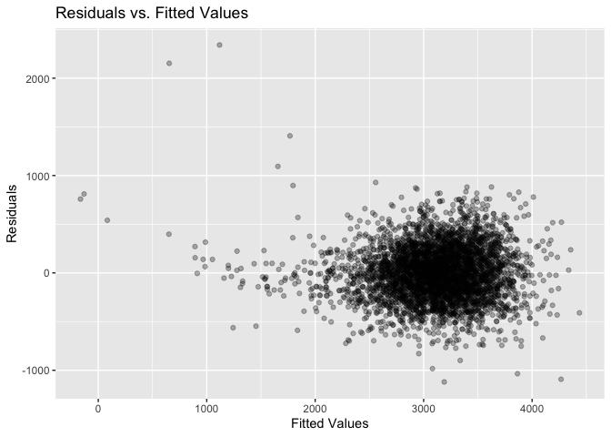

p8105_hw6_xg2451
================

# Problem 1

``` r
library(dplyr)
weather_df = 
  rnoaa::meteo_pull_monitors(
    c("USW00094728"),
    var = c("PRCP", "TMIN", "TMAX"), 
    date_min = "2017-01-01",
    date_max = "2017-12-31") |> 
  mutate(
    name = recode(id, USW00094728 = "CentralPark_NY"),
    tmin = tmin / 10,
    tmax = tmax / 10) |> 
  select(name, id, everything())
```

#### Perform Bootstrap Sampling and Fit Linear Regression Models

``` r
library(tidyr)
library(modelr)
library(tidyverse)
library(purrr)
library(broom)

set.seed(123)
boot_fit <- weather_df |> 
  modelr::bootstrap(n = 5000)  |> 
  mutate(
    models = map(strap, \(df) lm(tmax ~ tmin, data = df)),
    # Extract regression coefficients
    results = map(models, broom::tidy),
    # Extract model summary statistics r^2
    glance = map(models, broom::glance)
  ) |> 
  select(-strap, -models)
```

#### Extract and Compute $r^2$ and log($\hat{\beta}_0\times\hat{\beta}_1$)

``` r
boot_summary <- boot_fit |> 
  mutate(
    # Extract r^2 
    r_squared = map_dbl(glance, \(g) g$r.squared),
    # Compute log(beta0 * beta1)
    log_beta_product = map_dbl(results, \(res) {
      beta_0 <- res |> filter(term == "(Intercept)") |> pull(estimate)
      beta_1 <- res |> filter(term == "tmin") |> pull(estimate)
      log(beta_0 * beta_1)
    })
  )
```

#### Plot the Distributions of $r^2$ and log($\hat{\beta}_0\times\hat{\beta}_1$)

``` r
library(ggplot2)
# Plot the distribution of r^2
ggplot(data = data.frame(r_squared = boot_summary$r_squared), aes(x = r_squared)) +
  geom_density() +
  labs(
    title = "Distribution of r-squared",
    x = "r-squared",
    y = "Density"
  )
```

<!-- -->

``` r
# Plot the distribution of log(beta0 * beta1)
ggplot(data = data.frame(log_beta_product = boot_summary$log_beta_product), aes(x = log_beta_product)) +
  geom_density() +
  labs(
    title = "Distribution of log(beta0 * beta1)",
    x = "log(beta0 * beta1)",
    y = "Density"
  )
```

<!-- -->

**Description:**

Both distributions show relatively low variability, indicating that the
regression model’s performance metrics and parameter estimates are
stable under resampling. The high concentration of $r^2$ near 0.92
confirms a strong model fit, while the narrow range of
log($\hat{\beta}_0\times\hat{\beta}_1$) implies consistent relationships
between the predictor and response.

#### Compute 95% Confidence Intervals

``` r
r_squared_ci <- quantile(boot_summary$r_squared, c(0.025, 0.975))
log_beta_product_ci <- quantile(boot_summary$log_beta_product, c(0.025, 0.975))
```

For estimates of $r^2$, the 95% confidence interval is (0.895, 0.927).

For estimates of $\log(\hat{\beta}_0 \cdot \hat{\beta}_1)$, the 95%
confidence interval is (1.964, 2.058).

# Problem 2

#### Data preparation

``` r
homicide_data = read_csv("data/homicide-data.csv")
homicide_data <- homicide_data |> 
  mutate(
    city_state = paste(city, state, sep = ", "), # Create city_state variable
    victim_age = as.numeric(victim_age) # Ensure victim_age is numeric
  ) |>
  filter(
    !(city_state %in% c('Dallas, TX', 'Phoenix, AZ', 'Kansas City, MO', 'Tulsa, AL')), # Exclude cities by city_state
    victim_race %in% c("White", "Black") # Keep only White and Black victims
  )
```

#### Logistic Regression for Baltimore, MD

``` r
# Filter data for Baltimore, MD
baltimore_data <- homicide_data |> 
  filter(city_state == "Baltimore, MD")

# Fit logistic regression model
baltimore_model <- glm(
  disposition == "Closed by arrest" ~ victim_age + victim_sex + victim_race,
  data = baltimore_data,
  family = binomial()
)

# Extract ORs and confidence intervals
baltimore_results <-
  baltimore_model|> 
  broom::tidy(conf.int = TRUE, exponentiate = TRUE)|>
  mutate(CI = paste0('(', round(conf.low,3),', ', round(conf.high,3),')')) |> 
  filter(term == "victim_sexMale") |>
  select(OR = estimate, CI) 

baltimore_results |> 
  knitr::kable(digits = 3)
```

|    OR | CI             |
|------:|:---------------|
| 0.426 | (0.324, 0.558) |

The estimate and 95% confidence interval of the adjusted odds ratio are
0.426 and (0.324, 0.558) for solving homicides comparing male victims to
female victims keeping all other variables fixed.

#### Logistic Regression for All Cities

``` r
library(purrr)
# Fit logistic regression for each city
city_results <- homicide_data |>
  group_by(city_state) |>
  nest() |>
  mutate(
    models = map(data, \(df) glm(
      disposition == "Closed by arrest" ~ victim_age + victim_sex + victim_race,
      data = df,
      family = binomial()
    )),
    results = map(models, \(mod) broom::tidy(mod, exponentiate = TRUE, conf.int = TRUE))
  ) |>
  unnest(results) |>
  filter(term == "victim_sexMale")

# Filter and select only the relevant columns
city_results_summary <- city_results |>
  select(city_state, OR = estimate, conf.low, conf.high) 

city_results_summary |> 
  knitr::kable(digits = 3)
```

| city_state         |    OR | conf.low | conf.high |
|:-------------------|------:|---------:|----------:|
| Albuquerque, NM    | 1.767 |    0.825 |     3.762 |
| Atlanta, GA        | 1.000 |    0.680 |     1.458 |
| Baltimore, MD      | 0.426 |    0.324 |     0.558 |
| Baton Rouge, LA    | 0.381 |    0.204 |     0.684 |
| Birmingham, AL     | 0.870 |    0.571 |     1.314 |
| Boston, MA         | 0.674 |    0.353 |     1.277 |
| Buffalo, NY        | 0.521 |    0.288 |     0.936 |
| Charlotte, NC      | 0.884 |    0.551 |     1.391 |
| Chicago, IL        | 0.410 |    0.336 |     0.501 |
| Cincinnati, OH     | 0.400 |    0.231 |     0.667 |
| Columbus, OH       | 0.532 |    0.377 |     0.748 |
| Denver, CO         | 0.479 |    0.233 |     0.962 |
| Detroit, MI        | 0.582 |    0.462 |     0.734 |
| Durham, NC         | 0.812 |    0.382 |     1.658 |
| Fort Worth, TX     | 0.669 |    0.394 |     1.121 |
| Fresno, CA         | 1.335 |    0.567 |     3.048 |
| Houston, TX        | 0.711 |    0.557 |     0.906 |
| Indianapolis, IN   | 0.919 |    0.678 |     1.241 |
| Jacksonville, FL   | 0.720 |    0.536 |     0.965 |
| Las Vegas, NV      | 0.837 |    0.606 |     1.151 |
| Long Beach, CA     | 0.410 |    0.143 |     1.024 |
| Los Angeles, CA    | 0.662 |    0.457 |     0.954 |
| Louisville, KY     | 0.491 |    0.301 |     0.784 |
| Memphis, TN        | 0.723 |    0.526 |     0.984 |
| Miami, FL          | 0.515 |    0.304 |     0.873 |
| Milwaukee, wI      | 0.727 |    0.495 |     1.054 |
| Minneapolis, MN    | 0.947 |    0.476 |     1.881 |
| Nashville, TN      | 1.034 |    0.681 |     1.556 |
| New Orleans, LA    | 0.585 |    0.422 |     0.812 |
| New York, NY       | 0.262 |    0.133 |     0.485 |
| Oakland, CA        | 0.563 |    0.364 |     0.867 |
| Oklahoma City, OK  | 0.974 |    0.623 |     1.520 |
| Omaha, NE          | 0.382 |    0.199 |     0.711 |
| Philadelphia, PA   | 0.496 |    0.376 |     0.650 |
| Pittsburgh, PA     | 0.431 |    0.263 |     0.696 |
| Richmond, VA       | 1.006 |    0.483 |     1.994 |
| San Antonio, TX    | 0.705 |    0.393 |     1.238 |
| Sacramento, CA     | 0.669 |    0.326 |     1.314 |
| Savannah, GA       | 0.867 |    0.419 |     1.780 |
| San Bernardino, CA | 0.500 |    0.166 |     1.462 |
| San Diego, CA      | 0.413 |    0.191 |     0.830 |
| San Francisco, CA  | 0.608 |    0.312 |     1.155 |
| St. Louis, MO      | 0.703 |    0.530 |     0.932 |
| Stockton, CA       | 1.352 |    0.626 |     2.994 |
| Tampa, FL          | 0.808 |    0.340 |     1.860 |
| Tulsa, OK          | 0.976 |    0.609 |     1.544 |
| Washington, DC     | 0.690 |    0.465 |     1.012 |

#### Plot Estimated ORs and Confidence Intervals

``` r
plot_data <- city_results |> 
  select(city_state, estimate, conf.low, conf.high) |>
  arrange(estimate)

# Plot
ggplot(plot_data, aes(x = reorder(city_state, estimate), y = estimate)) +
  geom_point() +
  geom_errorbar(aes(ymin = conf.low, ymax = conf.high), width = 0.2) +
  coord_flip() +
  labs(
    title = "Adjusted Odds Ratios for Male vs. Female Victims",
    x = "City",
    y = "Odds Ratio (Male vs Female)"
  )
```

<!-- -->

**Comment:**

The plot shows the adjusted odds ratios (ORs) for solving homicides
involving male victims compared to female victims across cities. Most
ORs hover around 1, suggesting little difference in likelihood for many
cities. However, there are cities with ORs significantly above 1 (e.g.,
Albuquerque, NM) and others with ORs below 1, indicating differences in
solving rates between male and female victims. The wide confidence
intervals for some cities indicate higher uncertainty, likely due to
smaller sample sizes.

# Problem 3

#### Load and Clean the Data

``` r
birthweight_data = 
  read_csv("data/birthweight.csv", na = c("", "NA", "Unknown")) |>
  janitor::clean_names() |>
  mutate(babysex = as.factor(babysex),
         frace = as.factor(frace),
         malform = as.factor(malform),
         mrace = as.factor(mrace))
```

``` r
sum(is.na(birthweight_data))
```

    ## [1] 0

#### Variable Selection and My Model

To identify the most important predictors for birthweight (bwt), I
started by fitting a full model that included all available predictors.
Then, I used a backward selection approach, retaining variables with
p-values less than 0.05.

``` r
full_model = lm(bwt ~ ., data = birthweight_data)

summary(full_model)$coefficients |>
  as.data.frame() |>
  rownames_to_column("variable") |>
  filter(`Pr(>|t|)` < 0.05) |>
  pull(variable)
```

    ## [1] "(Intercept)" "babysex2"    "bhead"       "blength"     "delwt"      
    ## [6] "gaweeks"     "mrace2"      "parity"      "smoken"

Then refit the model

``` r
# Fit a new model using only significant predictors
my_model <- lm(bwt ~ babysex + bhead + blength + delwt + gaweeks + mrace + parity + smoken, data = birthweight_data)

summary(my_model)
```

    ## 
    ## Call:
    ## lm(formula = bwt ~ babysex + bhead + blength + delwt + gaweeks + 
    ##     mrace + parity + smoken, data = birthweight_data)
    ## 
    ## Residuals:
    ##      Min       1Q   Median       3Q      Max 
    ## -1119.67  -181.24    -5.87   173.51  2340.76 
    ## 
    ## Coefficients:
    ##               Estimate Std. Error t value Pr(>|t|)    
    ## (Intercept) -5822.5934    98.8325 -58.914  < 2e-16 ***
    ## babysex2       28.6609     8.4951   3.374 0.000748 ***
    ## bhead         131.6982     3.4607  38.056  < 2e-16 ***
    ## blength        75.8653     2.0210  37.538  < 2e-16 ***
    ## delwt           2.2649     0.1961  11.550  < 2e-16 ***
    ## gaweeks        12.1400     1.4654   8.284  < 2e-16 ***
    ## mrace2       -146.7893     9.2435 -15.880  < 2e-16 ***
    ## mrace3        -71.5880    42.4809  -1.685 0.092026 .  
    ## mrace4       -119.5979    18.7656  -6.373 2.04e-10 ***
    ## parity         98.6113    40.5334   2.433 0.015021 *  
    ## smoken         -4.7472     0.5882  -8.071 8.96e-16 ***
    ## ---
    ## Signif. codes:  0 '***' 0.001 '**' 0.01 '*' 0.05 '.' 0.1 ' ' 1
    ## 
    ## Residual standard error: 273.8 on 4331 degrees of freedom
    ## Multiple R-squared:  0.7148, Adjusted R-squared:  0.7142 
    ## F-statistic:  1086 on 10 and 4331 DF,  p-value: < 2.2e-16

#### Residual Plot

``` r
birthweight_data |>
  modelr::add_predictions(my_model) |> 
  modelr::add_residuals(my_model) |> 
  ggplot(aes(x = pred, y = resid)) + 
  geom_point(alpha = 0.3) + 
  labs(title = "Residuals vs. Fitted Values",
       x = "Fitted Values",
       y = "Residuals") 
```

<!-- -->

The residual plot indicates no major deviations from model assumptions.
The points are evenly distributed around zero, suggesting that the model
fits the data reasonably well.

#### Model Comparison Using Cross-Validation

Compared my proposed model to two alternative models using
cross-validation, randomly split the data into training and testing
sets, repeating this process 100 times. For each split, calculated the
root mean squared error (RMSE) to evaluate prediction accuracy.

``` r
set.seed(1)
# Perform cross-validation
cv_data <- crossv_mc(birthweight_data, 100) |>
  mutate(
    train = map(train, as_tibble),
    test = map(test, as_tibble)
  ) |>
  mutate(
    my_model = map(train, \(df) lm(bwt ~ babysex + bhead + blength + delwt + gaweeks + mrace + parity + smoken, data = df)),
    model_1 = map(train, \(df) lm(bwt ~ blength + gaweeks, data = df)),
    model_2 = map(train, \(df) lm(bwt ~ bhead * blength * babysex, data = df))
  ) |>
  mutate(
    rmse_my_model = map2_dbl(my_model, test, \(mod, df) rmse(model = mod, data = df)),
    rmse_model_1 = map2_dbl(model_1, test, \(mod, df) rmse(model = mod, data = df)),
    rmse_model_2 = map2_dbl(model_2, test, \(mod, df) rmse(model = mod, data = df))
  )

cv_data |> 
  summarize(mymodel_mean_rmse = mean(rmse_my_model),
            model1_mean_rmse = mean(rmse_model_1),
            model2_mean_rmse = mean(rmse_model_2)) |>
  knitr::kable(digits = 3)
```

| mymodel_mean_rmse | model1_mean_rmse | model2_mean_rmse |
|------------------:|-----------------:|-----------------:|
|           274.105 |          332.229 |          288.603 |

#### Visualization of RMSE Distributions

``` r
cv_data |> 
  select(starts_with("rmse")) |> 
  pivot_longer(
    everything(),
    names_to = "model", 
    values_to = "rmse",
    names_prefix = "rmse_") |> 
  mutate(model = fct_inorder(model)) |> 
  ggplot(aes(x = model, y = rmse)) +
  geom_violin()
```

<!-- -->

**Summary of Results:**

The violin plot illustrates the RMSE distributions for the three models.
The proposed model (my_model) demonstrates the lowest RMSE (mean =
274.11), outperforming both the simpler model (model_1, mean = 332.23)
and the interaction-heavy model (model_2, mean = 288.60).

This indicates that my proposed model achieves a better balance between
prediction accuracy and complexity, making it the most suitable for
predicting birthweight.
